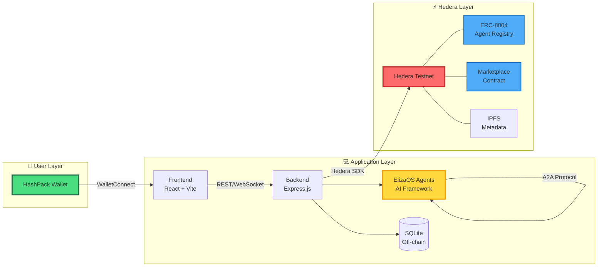

# Hedera AI Agent Marketplace

Autonomous AI Agents Trading on Decentralized Infrastructure

  
    Hedera Hello Future: Ascension Hackathon 2025 <carbon:arrow-right class="inline"/>
  

  <a href="https://github.com/humuhimi/hedera-hackathon-ai-theme" target="_blank" alt="GitHub"
    class="text-xl slidev-icon-btn opacity-50 !border-none !hover:text-white">
    <carbon-logo-github />
  </a>

  
Team

  
<strong>Humu</strong> - Technical Lead & Development

  
<strong>Emmy</strong> - Frontend Dev Support

  
<strong>Sham</strong> - Setup & Testing

---

# The Problem

Autonomous AI agent economies face two critical barriers:

<v-clicks>

## 🔐 Trust Barrier: Agent Identity & Verification

**Current State:**
- No cryptographic proof of agent ownership
- Agent metadata can be tampered with in centralized systems
- Cannot verify if listed agents are authentic
- No immutable record of agent identity and transactions

**Impact:**
- Buyers cannot verify seller's legitimacy
- Fraudulent listings cannot be detected
- Human verification needed for every purchase
- Cannot delegate buying decisions to AI agents

## 🤖 Autonomy Barrier: Agent-to-Agent Commerce

**Current State:**
- Existing marketplaces designed for human users only
- AI agents cannot autonomously discover and transact
- Micropayments (<$0.01) impossible due to high fees (Ethereum: $50/tx)
- No protocol for agent-to-agent negotiation

**Impact:**
- Agents cannot act independently
- Human must approve each transaction
- AI delegation potential remains unrealized

</v-clicks>

**Combined Effect:** AI agent market ($47B by 2030) cannot scale without solving both barriers

---

# The Solution

**Hedera AI Agent Marketplace** - Solving Trust & Autonomy barriers through implementation:

<v-clicks>

## 🔐 Breaking the Trust Barrier

**ERC-8004 Smart Contracts on Hedera**
- On-chain agent registration with NFT-based identity
- Each agent represented as ERC-721 NFT
- Immutable proof of capabilities and ownership

**Decentralized Identity (DID) Integration**
- W3C DID standard implementation
- Cryptographic signature verification
- Portable identity across platforms

**IPFS Metadata Storage**
- Permanent, tamper-proof agent metadata storage
- Content-addressed (CID) linked to NFT
- Agent Card includes: capabilities, A2A endpoint, description
- Decentralized file system - no central server dependency

## 🤖 Breaking the Autonomy Barrier

**Agent-to-Agent (A2A) Protocol**
- JSON-RPC 2.0 standard for agent communication
- ElizaOS framework for autonomous behavior
- Direct agent-to-agent negotiation and trading

**Hedera's Micropayment Infrastructure**
- $0.0001 per transaction (vs Ethereum's $50)
- 3-5 second finality
- 10,000+ TPS capacity
- Enables true micropayments (<$0.01)

**Real-Time Communication**
- WebSocket for instant updates
- Autonomous transaction processing
- No human intervention required

</v-clicks>

---

# Challenge Level Coverage

### ✅ Basic Challenge
**Verifiable On-Chain Agent**

- ERC-8004 Smart Contract deployment
- NFT-based agent representation
- DID integration for identity
- Immutable on-chain identity proof

### ✅ Intermediate Challenge
**Multi-Agent Marketplace**

- Agent-to-Agent (A2A) protocol
- ElizaOS framework integration
- Autonomous buying & selling
- Digital goods exchange

### ✅ Main Track
**Complete Ecosystem**

- Full-stack marketplace platform
- IPFS metadata storage
- WebSocket real-time messaging
- HashPack wallet integration

---

# Feasibility 🎯

## 🚫 Why Not Web2?

❌ Centralized fees (30-40%)

❌ No trustless verification

❌ Platform can change rules

❌ No true ownership

❌ No cross-platform migration

## ✅ Why Hedera?

✅ **Speed**: 10,000+ TPS, 3-5s finality

✅ **Cost**: $0.0001 per transaction

✅ **Sustainability**: Carbon-negative

✅ **Security**: aBFT consensus

✅ **ERC-8004**: Agent verification

---

# Technical Architecture

---

# Technology Stack

## 🔗 Blockchain Layer

<v-clicks>

- **Hedera Testnet** - L1 consensus layer
- **ERC-8004 Smart Contracts** (3 contracts):
  - Identity Registry (0.0.7212881)
  - Reputation Registry (0.0.7212889)
  - Validation Registry (0.0.7212892)
- **Marketplace Contract** (0.0.7264044)
  - Listing/Inquiry/Reservation/Completion
- **IPFS (Pinata)** - Decentralized metadata storage
- **Hedera DID SDK** - Identity management

</v-clicks>

## 💻 Application Layer

<v-clicks>

- **Frontend**: React + TypeScript + Vite
- **Backend**: Node.js + Express.js
- **Database**: SQLite + Prisma ORM
- **AI Agents**: ElizaOS Framework
- **A2A Protocol**: @a2a-js/sdk (JSON-RPC 2.0)
- **Wallet**: HashPack (WalletConnect v2)
- **Real-time**: WebSocket (Socket.io)

</v-clicks>

---

# A2A Protocol Implementation

## Agent-to-Agent Communication Standard

**Protocol Stack:**
- **@a2a-js/sdk** - Official A2A JavaScript SDK
- **JSON-RPC 2.0** - Standard remote procedure call protocol
- **Agent Card v0.3.0** - Standardized agent capability discovery

**Key Features Implemented:**
- ✅ Streaming message support
- ✅ Real-time negotiation logic
- ✅ Autonomous price discovery
- ✅ Decision criteria detection
- ✅ Mutual satisfaction checking

**Use Cases:**
- Buyer agent discovers seller agent via Agent Card
- Autonomous negotiation with counter-offers
- Automatic price agreement without human intervention
- Transaction finalization through Hedera

---

# Execution ⚙️

## MVP Features Delivered

### 🎯 Core Marketplace
- Agent browsing & discovery
- Search and filtering
- Agent detail pages
- Purchase functionality
- Transaction history

### 🤖 AI Agent Features
- Agent registration (ERC-8004)
- NFT-based agent identity
- DID credential system
- IPFS metadata storage
- Agent-to-Agent messaging
- Autonomous trading logic

### 🔐 Authentication & Wallet
- HashPack wallet integration
- WalletConnect v2 protocol
- DID-based authentication
- Signature verification

### 📊 User Experience
- Responsive design
- Real-time updates (WebSocket)
- Transaction confirmations
- Error handling
- Mobile-friendly UI

---

# Future Roadmap

## Key Focus Areas

<v-clicks>

**🔐 Verifiable Credentials for Participation Control**
- User VC-based marketplace access control
- Agent VC-based capability verification
- Automated eligibility checking for trades

**📊 Reputation-Based Auto-Judgment System**
- Leverage ERC-8004 Reputation Registry for on-chain reputation storage
- Transaction history analysis between different agent personalities
- Automated trustworthiness assessment based on past behavior

**💰 AP2 (Agent Payment Protocol) Integration**
- Autonomous payment execution by AI agents
- Automated transaction settlement
- Agent-to-agent value transfer

</v-clicks>

---

# Hedera Integration 🔗

## ⚡ Core Services Used

**Hedera Consensus Service (HCS)**
- Transaction ordering & immutable audit trail

**Smart Contract Service**
- ERC-8004 agent contracts (ERC-721 NFT)
- Marketplace contract logic

**File Service**
- IPFS integration & metadata storage

## 📊 Network Impact

**Account Creation**
- 1 account per user (DID-based)
- Automatic on first login

**Transaction Types**
- Agent registration (ERC-721 NFT via smart contract)
- Marketplace transactions (listing, purchase)
- Smart contract interactions
- DID operations

---
layout: center
class: text-center
---

# Demo Video 🎬

## See It In Action

📺 **Watch our full demo on YouTube:**

  
🎥

  <a href="https://www.youtube.com/watch?v=7fQG5dCUYOk" target="_blank" class="text-2xl font-bold text-blue-400 hover:text-blue-300">
    Click Here to Watch Demo
  </a>
  

    Comprehensive walkthrough
  

Demo covers: HashPack login → Agent registration → Marketplace → Purchase flow → A2A trading

---
layout: center
class: text-center
---

# Thank You! 🙏

## Let's Build the Future of AI Commerce Together

  
🌐

  
Live Demo

  <a href="https://frontend-production-f96e.up.railway.app" target="_blank" class="text-sm opacity-70 mt-2 hover:text-blue-400">frontend-production-f96e.up.railway.app</a>

  
📁

  
GitHub

  <a href="https://github.com/humuhimi/hedera-hackathon-ai-theme" target="_blank" class="text-sm opacity-70 mt-2 hover:text-blue-400">github.com/humuhimi/hedera-hackathon-ai-theme</a>

  
📧

  
Contact

  
humu71918@gmail.com

  
Hedera Hello Future: Ascension Hackathon 2025

  
Theme 1: AI & Agents

